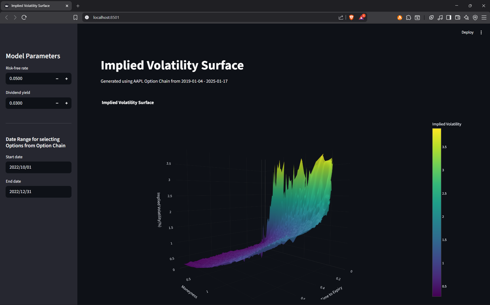

# Implied-Volatility-Surface

Web-based dashboard built with **Streamlit** and **QuantLib** using the **Black–Scholes–Merton** framework to explore **Implied Volatility Surfaces**.  
It provides adjustable parameters and interactive **3D visualizations** showing the relationship between **Spot Price**, **Strike Price**, and **Time to Expiry** versus **Implied Volatility**.  
Designed for quantitative finance learners and traders to analyze option dynamics.

---

## 🚀 Features
- Interactive **3D implied volatility surface plots**
- Adjustable inputs for **Option Dates to use**
- Built with **Python**, **Streamlit**, **Plotly**, and **QuantLib**
- Educational tool for understanding volatility behavior in options markets

---

## 📁 Project Structure
Implied-Volatility-Surface/  
├── assets/  
│ └── preview.png  
│── app.py  
│── utils.py  
│── requirements.txt  
│── environment.yml  
└── README.md  

---

## ⚠️ Dataset Notice

The dataset required to generate the implied volatility surface **is not included in this repository** due to size and distribution constraints.  

---

## 📸 Example Screenshot  
 

## ⚙️ Installation

### 1️⃣ Using Pip
```bash
git clone https://github.com/AnjaneeyaB/Implied-Volatility-Surface.git
cd Implied-Volatility-Surface
```
Create a virtual environment with Python and activate it.
```bash
pip install -r requirements.txt
```
### 2️⃣ Using Conda
```bash
git clone https://github.com/AnjaneeyaB/Implied-Volatility-Surface.git
cd Implied-Volatility-Surface
conda env create -f environment.yml
conda activate implied-volatility-surface
```
  
  📦 Dependencies

Python  
Streamlit  
Plotly  
QuantLib  
Pandas  
NumPy  
  
  ## 📜 License

This project is licensed under the MIT License.  
You are free to use, modify, and distribute it with attribution.  

  
  
  ## 👤 Author

Anjaneeya B  
GitHub: @AnjaneeyaB  
  
“Volatility is not risk; ignorance is.”
